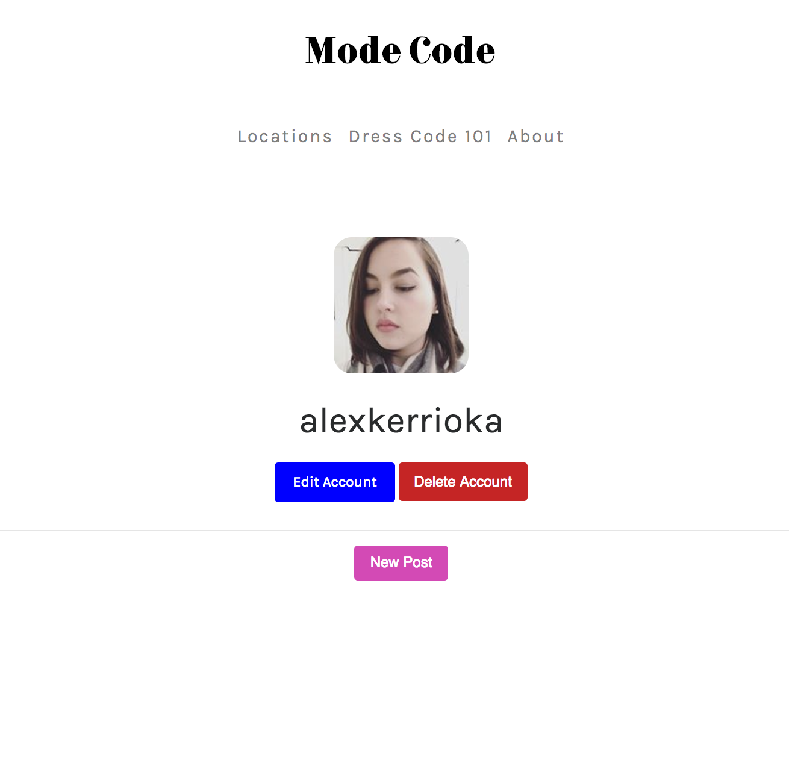
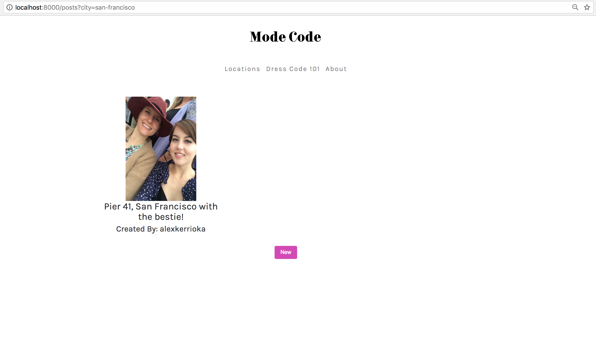
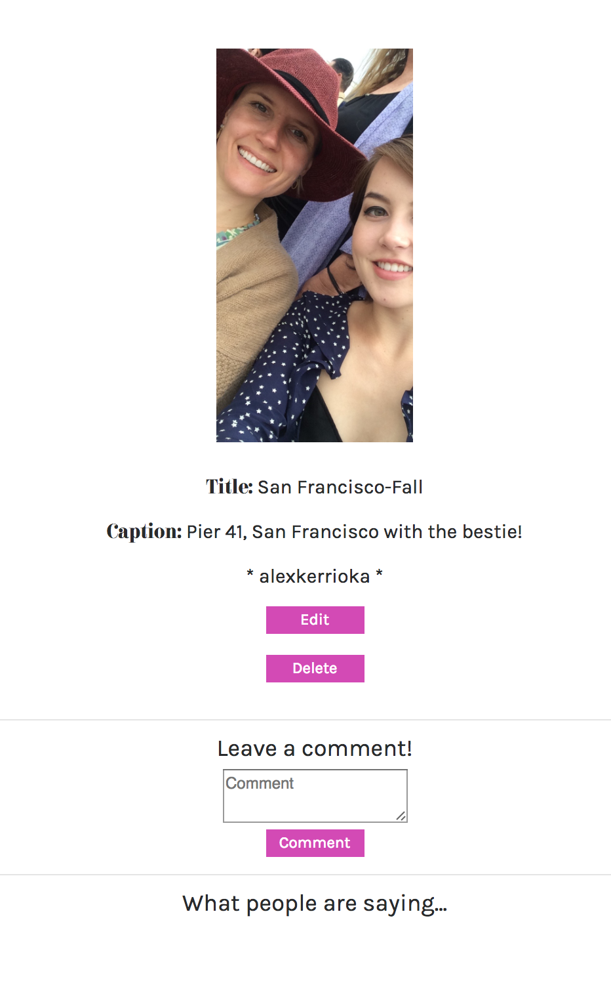
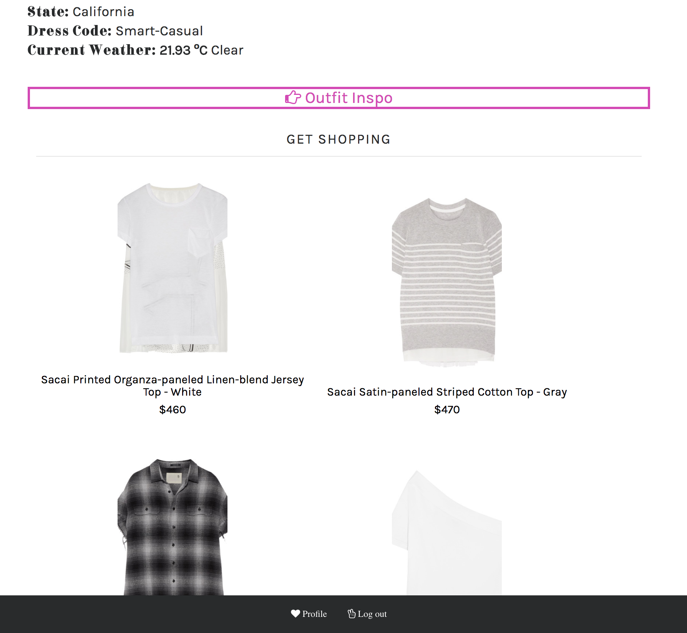

# Project 1: WDI 27

## Introduction

Welcome to my repository for Mode Code, a fashion application that allows content posting of images and text, requires user registration or login (offers secure registration), and utilizes two APIs for weather updates and online shopping.

## Installation and Setup

Installation steps are listed below:

* Download or clone this repo
* copy `npm i` or `yarn add` into you terminal to install dependencies
* run `gulp` in your terminal to compile the source code and open in browser
* _Enjoy_!

### A short description

Mode Code is an app with components of a blog, store, and information website. Users can add cities to the existing locations index, post content with images, shop the latest fashion pieces by category, and maintain their profile.

The app requires registration or logging in to access the API content. Users can choose to login with Instagram, Github, or through registrating with the app. Additionally, once a user is verified they can post content and comment on other people's posts.

Posting is easy. Users can upload images of their outfits and specify which location it was taken (from San Francisco to Paris). Only the owner of a post can edit or delete it, but other users can comment on the content.

Additionally, the two APIs offer weather updates to each location in the location index and current fashion items for sale online specified by the location's dress code and environment.

### Technologies used

These are the languages and softwares used in this game:

- HTML 5
- SCSS
- Bootstrap
- JavaScript ES6
- jQuery 3.10
- Ajax
- Gulp
- Yarn
- NPM
- Bcrypt
- Amazon Web Services
- Oauth: Instagram, Github
- Darksky API
- Shopstyle API
- Git & github
- Heroku

Oauth and bcrypt are used for user registration and login and Instagram and Github are available as login options. The Darkstyle API is installed to receive live weather updates. The Shopstyle API is installed for access to fashion retail data that can be filtered by brand, category, color, pricd, etc.

### Challenges faced

This app was fun to build, but was challenging. The Shopstyle API would not have been installed without the help of Insomnia. Designing the app with functionality and a good user experience at the same time required juggling. Additionally, managing the various keys, access permissions, and links for oauth, image uploading, and APIs required a notebook and frequent brainstorms.

### Rounding it off

For improvements I'd like to:

- Increase the Shopstyle API categories displaced for each location
- Display posts made by a user under their profile page
- Allow users to create their own list for shopping items
- Allow users to create their own lists for cities
- Include Facebook and Twitter login options
- Improve the design

Interested in following my future projects? Link with me on [Github](https://github.com/alexandriako).
